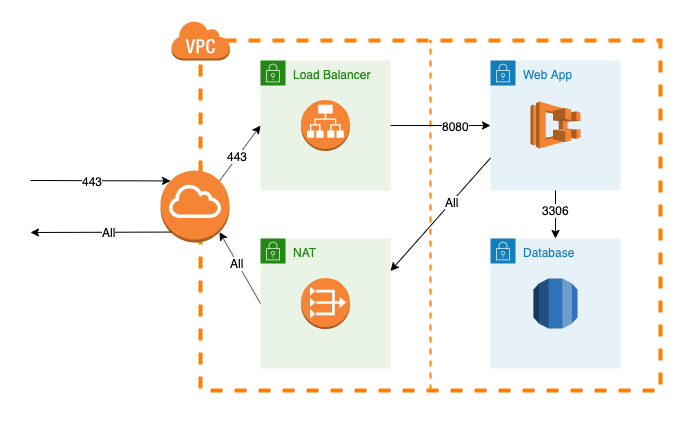

# JamfPro-AWS
Concept templates and resources for deploying Jamf Pro environments and tools in AWS.

## Jamf Pro Template

This is an all-in-one template that will create an entire Jamf Pro environment in the AWS region you deploy to.

This template does not create a _production-ready_ environment, but more of a _production-like_ environment and allows for rapid experimentation and testing that could be applied to a production environment that exists in AWS.

The template will create the following resources based upon options and values set in the CloudFormation Parameters:

- VPC
  - Internet Gateway
  - Subnets
  - Routes
  - Security Groups
  - NAT Instance (`t3a.nano`)
- Application Load Balancer
  - Defaults to HTTP
  - Enable HTTPS by providing ACM Certificate ARN
- Aurora Cluster
  - Defaults to Aurora Serverless
  - Single instance Auora Cluster if `DatabaseMode` parameter set to `cluster`
  - Both modes use Aurora-MySQL Engine 5.6.10a
- Fargate Cluster
  - Single ECS Task Definition for Jamf Pro container
    - 512 CPU, 2048 Memory
  - Single ECS Service to run the Task

The following is an overview of the default VPC network that is created:

The deployed resources will incur cost. **Tear down the stack when not in use.**
